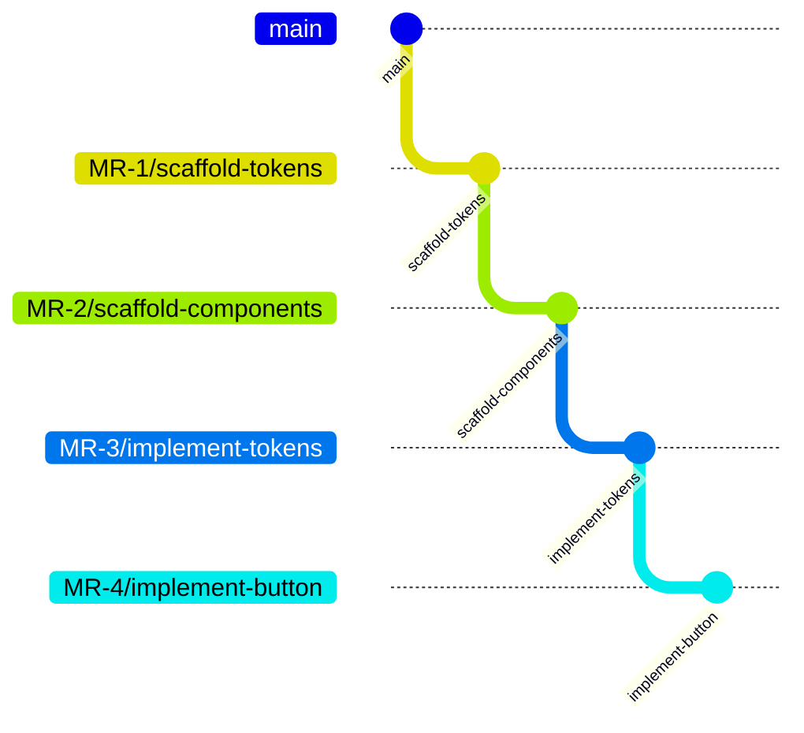
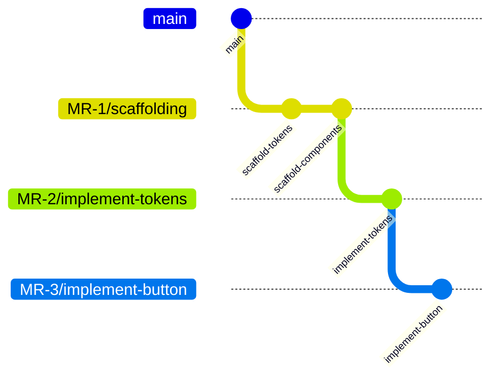
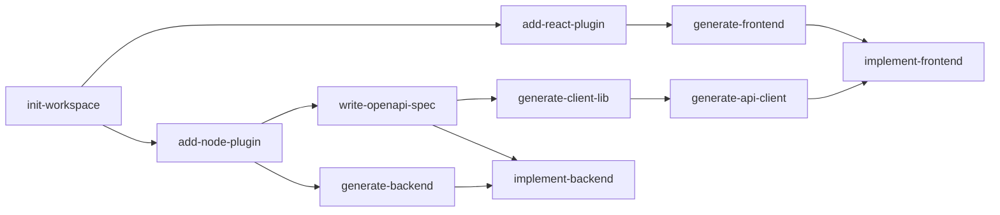

# What If AI Coding Agents Produced MR Stacks Instead of Giant Diffs?

_A design sketch for reducing review load, context switching, and delivery risk around generated code._

## The Problem: Landing Generated Code Well

AI can generate useful code now. For many teams, generation is no longer the only hard part.

The harder problem is making sure that code *lands well* — in the right order, in the right shape, in a way that doesn't overwhelm the person reviewing it or the colleague who inherits it six months from now.

When you ask an AI agent to build a full-stack feature, it can produce hundreds of lines across dozens of files. Drop all of that into a single merge request and you've created a wall of code that nobody wants to review. Your reviewers skim it, approve it, and move on. Bugs hide. Design problems slip through. Technical debt accrues silently.

The cognitive load doesn't just fall on reviewers. It falls on *you*. You have to mentally track which pieces depend on which, what order things need to happen in, and whether the agent actually did what you asked. You're managing an assembly line in your head.

Fabster is an idea for tackling this. It would let you define multi-step workflows for fabricating code — where each step can produce its own branch, its own merge request, and its own quality gates. The goal is for code to land incrementally, in reviewable pieces, and in the right order.

This is a design sketch, not a claim that the model is proven. I’m writing it down to pressure-test the idea: what breaks, what is overcomplicated, and what would actually help teams review AI-generated code?

This post sketches the core ideas behind Fabster and the tradeoffs I’m trying to understand.

---

## The Core Idea: Workflows That Produce Stacked Merge Requests

The central concept is simple: break a large generated-code task into a sequence of nodes. Each node does its work and commits the result. You choose the granularity — a node can simply commit to the current branch, or it can create its own branch and merge request. When you opt for MRs, they stack on top of each other — MR #2 branches off MR #1, MR #3 branches off MR #2, and so on.

Maybe you want every step to be its own MR:



Or maybe you group related scaffolding into commits on a single branch and only split at the implementation boundary:



Either way, each MR is small, focused, and independently reviewable. A reviewer can look at "scaffold the tokens library" in isolation, approve it, then move on to "implement the token values." The cognitive load per review drops dramatically.

This resembles how experienced engineers often work when they tackle large features manually — they break the work into a stack of commits and MRs. The question is whether that discipline can be made explicit enough for generated code without adding too much process.

---

## The MVP: Keep the First Version Small

The first useful version of Fabster does not need every idea in this document. The implementation target for v0 is:

- A workflow DAG that describes nodes and dependencies
- Sequential execution in topological order
- Command nodes with scripted steps
- Task nodes resolved to native or external agents
- A repository workspace mounted at `/repo`
- Per-node permissions for filesystem access, tools, network, and secrets
- Git branch and worktree creation for each MR-producing node
- Commits and stacked merge requests
- Validation gates such as build, lint, format, and tests
- Optional blocking review gates before continuing to the next node
- A structured event stream that a CLI can render

That is enough to prove the core value: fabricated code lands as small, validated, reviewable increments instead of one oversized diff.

Everything else is deliberately out of scope for v0: parallel or speculative execution, nested workflow runs, plugins, durable agent memory, reputation, self-improving skills, typed resource adapters, remote execution, and workflow dashboards. Those ideas may matter later, but Fabster should be useful before it becomes a platform.

---

## Two Kinds of Work: Commands and Tasks

Every node in a workflow runs either a **command** or a **task**. The distinction matters.

A **command** is scripted work: one or more predefined operations executed in order. It might run a shell command, a package-manager command, a code generator, or a small script. The important property is that the execution path is explicit ahead of time.

Commands are not magically deterministic. A generator can change behavior when tool versions change. A dependency install can change when the registry changes. Fabster makes commands reproducible by controlling the inputs that matter: command steps, arguments, tool versions, working directory, environment, lockfiles, and declared network access.

```typescript
const createReactLibrary = command({
  name: 'create-react-library',
  purpose: 'Create a React library in the monorepo',
  steps: [
    run('nx generate @nx/react:library --name={name} --scope={scope}'),
    run('nx format:write'),
    run('nx run {scope}-{name}:lint'),
  ],
  inputs: {
    name: string(),
    scope: string(),
  },
  gates: [successfulBuild(), formatted(), linted()],
});
```

A **task** describes *what* needs to happen but not *how* or *by whom*. Some tasks are fully agentic — an AI agent picks them up and runs autonomously. Others require a human in the loop, or a human and an AI working together. The task doesn't prescribe the execution model.

A task can declare the resources and capabilities it needs:

- **Skills** — the capabilities required (e.g., code generation, testing, TypeScript)
- **Mounts** — the workspace resources it needs access to. In the MVP, this can just be the repo
- **Services** — optional external integrations. In later versions, this could include a design system API, a ticket tracker, a notification channel, or a CI pipeline

The execution engine uses all of this to assign the right worker, provision the right environment, and grant the right access.

```typescript
const implementComponent = task({
  name: 'implement-component',
  purpose: 'Implement a React component with tests',

  // What skills are needed — used for agent matching
  requirements: [
    require('agent.skill', { name: 'code-generation', language: 'typescript' }),
    require('agent.skill', { name: 'testing' }),
  ],

  // Guidance for the worker
  instructions: [
    'Use functional components with hooks',
  ],

  // Expected properties of the output
  rules: [
    'Co-locate test files next to source files',
  ],

  // Data flowing in and out
  inputs: {
    componentName: string(),
    library: string(),
  },
  outputs: {
    componentPath: string(),
  },

  // What the task needs access to
  mounts: ['/repo'],
  permissions: {
    fs: { read: ['/repo/**'], write: ['/repo/packages/ui/**'] },
    tools: ['node@22', 'npm'],
    network: 'restricted',
    secrets: [],
  },

  // How to sandbox execution
  sandbox: 'bubblewrap',

  // Quality checks
  gates: [successfulBuild(), humanApproved()],
});
```

A task definition is a complete description of a unit of work:

- **Name and purpose** — what it's called and what it does
- **Requirements** — the skills needed, used to match an agent
- **Instructions** — guidance for the worker. These shape the implementation but do not, by themselves, prove correctness
- **Rules** — expected properties of the output. Some rules can be checked automatically, such as "component must have a corresponding test file." Others may become review checklist items until a verifier exists
- **Inputs and outputs** — typed data flowing in and out, chainable across nodes
- **Mounts** — which workspace resources the task needs access to
- **Services** — optional external integrations the task depends on
- **Permissions** — filesystem access and toolchain constraints
- **Sandbox** — the isolation level for execution
- **Gates** — executable pass/fail checks that decide whether the node can advance

Both commands and tasks declare **inputs** and **outputs**. Outputs from one node can be chained as inputs to the next — the execution engine wires them together. The data flows through the graph without manual plumbing.

```typescript
graph: (ctx) => {
  // Scaffold a shared UI library — outputs its import path
  const uiLib = ctx.run('create-ui-lib', createLibrary, {
    name: 'ui',
    scope: 'shared',
  });

  // Implement a button component in that library
  const button = ctx.run('impl-button', implementComponent, {
    library: uiLib.output('importPath'),  // e.g. '@shared/ui'
    componentName: 'button',
  }, { dependsOn: [uiLib] });

  // Build the app that consumes it — needs both the library and the component
  ctx.run('impl-app', implementApp, {
    uiLibrary: uiLib.output('importPath'),
    entryComponent: button.output('componentName'),
  }, { dependsOn: [button] });
};
```

The `uiLib.output('importPath')` reference tells the execution engine: "when the first node finishes, take its `importPath` output and pass it forward." The app node doesn't need to guess where the library ended up — it receives the answer from the node that created it.

The key insight: scaffolding and generation usually have an explicit execution path — use commands. Implementation and creative decisions do not — use tasks. Commands require controlled inputs. Tasks require judgment. Together, they define the full fabrication process.

---

## Agents and Capability Matching

Tasks don't reference agents directly. Instead, they advertise **requirements** — capabilities they need — and agents declare what they **provide**. The execution engine matches them automatically.

This is inspired by OSGi's service resolution model: consumers declare what they need, providers declare what they offer, and the framework wires them together. You never manually assign an agent to a task. You describe the work, agents describe their skills, and the best match gets picked.

```typescript
// A task advertises what it needs
const myTask = task({
  requirements: [
    require('agent.skill', { name: 'code-generation', language: 'typescript' }),
    require('agent.skill', { name: 'testing' }),
  ],
});

// An agent advertises what it can do
const myAgent = agent('coder', {
  capabilities: [
    provide('agent.skill', { name: 'code-generation', language: 'typescript' }),
    provide('agent.skill', { name: 'testing' }),
  ],
  instructions: 'You are a TypeScript code fabrication agent.',
  tools: { /* read files, write files, run commands, etc. */ },
});
```

Why decouple? Because the same task definition can be fulfilled by different agents depending on context. During development you might have an agent backed by a local model. In CI you might swap in a cloud-hosted agent. The task doesn't change — only the agent pool does. The execution engine handles model selection, reasoning level, and capability matching so you don't have to.

For the MVP, this is enough: agents are ephemeral workers matched to tasks by capability. They spin up for a task, do the work, and disappear.

Agents come in two flavors:

- **Native agents** run in-process with standard AI SDK tools (read files, write files, run commands)
- **External agents** spawn a subprocess — for example, a CLI-based coding agent

In principle, this means any AI coding tool can become a Fabster agent. If it can accept a prompt and modify files, it can participate in a workflow.

### Advanced Agent Behavior

More advanced versions can add **durable memory**. After each task, execution traces are analyzed — what worked, what failed, what strategies led to passing gates on the first try. These insights are extracted and stored in a persistent knowledge base that informs future runs. The agent instance is disposable; the knowledge it accumulates is not.

Agents can also build a **reputation**. After a task completes, the result can be voted up or down — job well done, or job poorly done. Over time, this reputation influences which agent gets picked for future tasks. An agent that consistently delivers clean, building code earns priority over one that doesn't.

Another advanced pattern is task decomposition. An agent that picks up a task can decompose it into a **sub-DAG** — breaking the work into smaller steps, executing them in order, and committing after each step. These are just commits, not MRs. The merge request only happens at the parent node level when the entire task is complete.

For example, an agent picks up "implement the backend." It internally breaks that into: create the types, implement the routes, add error handling, write tests. Each sub-step produces a commit. The reviewer sees one MR for "implement the backend" — but the commit history inside tells a clean, incremental story. The agent brought its own structure to the work without polluting the MR stack.

Everything still applies to the sub-DAG — sandboxing, permissions, instructions, rules, and gates. Sub-steps run within the same sandbox constraints as the parent task. The agent doesn't get extra access just because it decomposed the work.

---

## Planning Workflows

For the MVP, workflows can be written directly. A developer defines the graph, chooses which nodes are commands or tasks, adds gates, and decides where MRs should be created.

A workflow planner can help draft that workflow, but it is not required. You describe what you want to build — "add a payments module with Stripe integration" — and the planner proposes a graph: which nodes, what order, which tasks need agents, which steps are scripted commands, and which gates should apply.

You review, adjust, and approve the workflow before execution. Maybe you split a node, reorder steps, add a gate, or swap a command for a task. Execution then follows the approved workflow definition, not an open-ended plan hidden inside an agent prompt.

---

## The Execution Model

Once the workflow is approved, it defines a **graph** of nodes with explicit dependencies. The graph is a planning model, not a promise of parallel execution. At runtime, the engine chooses a topological order and executes nodes sequentially.

That distinction matters. A DAG lets you describe what depends on what. Sequential execution lets Fabster produce one clean, linear MR stack. Each node branches from the previous node's branch, so even if the workflow has independent branches conceptually, the code lands as an ordered sequence of reviewable changes.

```typescript
const myWorkflow = workflow({
  name: 'create-todomvc',
  workspace: workspace({
    '/repo': new DiskResource({ root: '/path/to/repo' }),
  }),
  graph: (ctx) => {
    const init = ctx.run('init-workspace', initWorkspace, { name: 'todomvc' });

    // These are both eligible after init; the engine chooses a sequential order
    const addReact = ctx.run('add-react', addPlugin, {
      plugin: '@nx/react',
    }, { dependsOn: [init] });

    const addNode = ctx.run('add-node', addPlugin, {
      plugin: '@nx/node',
    }, { dependsOn: [init] });

    // This can run after the React plugin is installed
    ctx.run('generate-frontend', generateApp, {
      generator: '@nx/react:app',
      name: 'web',
    }, { dependsOn: [addReact] });
  },
});
```

For each node, the engine executes the same basic lifecycle:

1. Creates a git branch and worktree
2. Runs the command or resolves an agent and executes the task
3. Commits the changes
4. Runs validation gates (build, lint, format, tests)
5. Creates a merge request if the node is configured to produce one
6. Waits for review gates if configured
7. Cleans up the worktree

If a node fails, all downstream nodes are skipped. The MR stack stops at the point of failure, giving you a clear picture of what worked and what didn't.

---

## Git and MR Lifecycle

For each MR-producing node:

1. Fabster creates a branch named `fabster/<workflow>/<node>`.
2. The first node branches from the workflow's base branch, usually `main`.
3. Each later node branches from the previous completed node's branch, producing a linear stack even when the workflow graph has independent branches.
4. Fabster creates a git worktree for the node branch.
5. The command or task runs inside that worktree.
6. Fabster commits the resulting changes with a node-specific commit message.
7. If there are no changes, the node can be marked complete without opening an MR.
8. Validation gates run against the worktree.
9. If validation passes, Fabster opens an MR targeting the previous branch in the stack.
10. If review gates are configured, Fabster waits before continuing to the next node.
11. The worktree is removed after the node is complete, failed, or gated.

If validation gates fail, the node enters the fix loop. If the worker cannot satisfy the gates, the node fails and downstream nodes are skipped. If human review requests changes, the node stays gated until those changes are addressed and the review gate passes.

### Blocking vs Speculative Execution

In the MVP, review gates are blocking. If a node requires human approval, Fabster does not execute downstream nodes until that approval is present. This keeps the branch stack simple: every downstream branch is based on reviewed work.

A future speculative mode could allow downstream nodes to run after validation gates pass but before review gates pass. That would improve throughput, but it introduces rebase and invalidation complexity when review changes an earlier node.

---

## Instructions, Rules, and Gates

Fabster separates three concepts that are easy to blur:

- **Instructions** shape how the worker approaches the task
- **Rules** describe expected properties of the output
- **Gates** are executable pass/fail checks that decide whether the node can advance

Instructions can be subjective or stylistic: "prefer functional components" or "keep the implementation simple." Rules should be more concrete: "component has a corresponding test file" or "no inline styles." Gates are the actual blockers: build, lint, format, tests, security scans, or human approval.

This separation keeps the system honest. A worker can follow instructions and satisfy rules, but a node is not complete until its gates pass.

**Validation gates** run automatically after execution:

- `successfulBuild()` — does it compile?
- `linted()` — does it pass linting?
- `formatted()` — is the code formatted?
- `testsPass()` — do the tests pass?

**Review gates** require human action:

- `humanApproved()` — the merge request must be approved by a reviewer before downstream work continues

Gates work hand-in-hand with rules. An agent or human can declare they're done, but the gates don't take their word for it — they check the evidence. Build logs, test reports, security scan results — gates look at concrete artifacts, not self-reported status. Completion is claimed by the worker; progress is allowed by the system.

When a gate fails, the node doesn't just stop — it enters a **fix loop**. The gate failure and its evidence (build log, test report, scan result) are fed back to the worker, who gets a chance to fix the issue and resubmit. This cycle repeats up to a configurable limit. If the worker can't satisfy the gates after repeated attempts, *then* the node fails and downstream work is skipped.

For the MVP, the fix loop can stop there: retry the node a few times, then fail clearly if the gates still do not pass.

### Advanced Skill Improvement

An advanced system can go further. Rather than accumulating an ever-growing list of rules, the fix loop can refine the **skill** itself. Skills are treated as living documents — trainable artifacts that evolve over time. When a fix loop succeeds, the execution trace is analyzed: what failed, what the fix was, what pattern it reveals. The skill's instructions and approach are updated accordingly — not bolted on as external rules, but woven into the skill itself.

Updating a skill is itself a workflow. The same execution model that fabricates code can also fabricate better skills — analyzing traces, proposing edits, validating that the updated skill performs better on held-out tasks before accepting the change. Skills improve through the same disciplined process as code: propose, validate, review, merge.

The next time any agent with that skill picks up a similar task, the knowledge is already baked in. The system gets smarter at the right layer — the skill, not a growing pile of rules.

This is where the stacked MR model really pays off. Each node's output is independently validated and reviewable. If a worker produces code that doesn't build, the gate catches it *at that node*, not three steps later when a downstream consumer fails mysteriously.

---

## Repository Workspace

The MVP only needs one workspace resource: the repository being changed. A workflow runs against a repo checkout, usually mounted at `/repo`. Each node can get its own git worktree so changes stay isolated until the node commits.

That is enough for the core loop: read code, write code, run commands, commit changes, run gates, and open the next MR in the stack.

```typescript
workspace: workspace({
  '/repo': new DiskResource({ root: '/path/to/repo' }),
}),
```

Later, workflows can add typed resource adapters for things outside the repo: document folders, object stores, issue trackers, databases, design systems, or chat systems. File-like resources can expose file operations. Non-file resources should expose explicit resource operations instead of pretending to be ordinary files.

The important point is not that every integration becomes a filesystem. The important point is that every resource is declared, permissioned, and visible to the execution engine. Agents only receive the repo paths and external operations their task is allowed to use.

---

## Sandboxing

When you let an agent loose on your codebase, you need to control what it can touch and what it can talk to. Sandboxing is a policy boundary, not just a filesystem boundary. A node declares what it can read, what it can write, which tools it can run, whether it can access the network, and which secrets or service credentials it can receive.

For the MVP, this policy can stay simple:

```typescript
permissions: {
  fs: { read: ['/repo/**'], write: ['/repo/packages/ui/**'] },
  tools: ['node@22', 'npm', 'git'],
  network: 'restricted',
  secrets: [],
},
```

That policy covers the main risks:

- **Filesystem access** — an agent implementing a component in `packages/ui` does not need write access to `apps/` or `infrastructure/`
- **Tool access** — each node declares the tools it needs and the versions it expects. No ambient toolchain, no "works on my machine"
- **Network access** — commands that install dependencies, call APIs, or fetch remote content need explicit network permission
- **Secrets and credentials** — tokens, environment variables, git credentials, package registry credentials, and service accounts are passed only when declared
- **Auditability** — commands, tool calls, file writes, gate results, and credential grants are logged as part of the node trace

The enforcement mechanism can vary. A simple git worktree gives each node a separate working copy. A local sandbox such as bubblewrap can restrict filesystem and network access on the host. A remote container can provide stronger isolation for untrusted work. These are implementation choices; the workflow model should describe the policy first, then let the runtime choose how to enforce it.

Capabilities and permissions are deliberately separate concepts. **Capabilities** (require/provide) determine *which agent* gets assigned. **Permissions** determine *what that agent can do* once it's running. An agent might have the skill to write TypeScript, but that doesn't mean it should have write access to your deployment config.

---

## Workflow Composition

Workflows can call other workflows. For the MVP, composition is graph expansion: calling another workflow inserts that workflow's nodes into the parent graph with namespaced node IDs. The resulting combined graph still executes sequentially and produces one linear MR stack.

A high-level workflow might define an entire product by composing smaller workflow fragments — one for the backend, one for the frontend, one for the infrastructure.

```typescript
const fullProduct = workflow({
  name: 'create-product',
  purpose: 'Create a full product from backend to frontend to deployment',
  graph: (ctx) => {
    const backend = ctx.run('backend', createBackendWorkflow, { name: 'api' });
    const frontend = ctx.run('frontend', createFrontendWorkflow, {
      apiUrl: backend.output('apiUrl'),
    }, { dependsOn: [backend] });
    ctx.run('infra', createInfraWorkflow, {
      services: [backend, frontend],
    }, { dependsOn: [frontend] });
  },
});
```

This keeps individual workflows focused and testable while allowing you to compose them into larger fabrication pipelines. More advanced versions could support nested workflow runs or nested MR stacks, but that is not required for the core model.

---

## Observability

When a workflow is running — with nodes moving through execution, validation, review, completion, or failure — you need to see what's happening. For the MVP, observability can be a structured event stream: node started, command run, tool called, file changed, gate passed, MR opened, node gated, node failed. A CLI can render that stream directly.

A dashboard can come later, reading the same event stream. Remote execution can also come later for long-running jobs or CI-triggered pipelines. Neither is required for the core model.

---

## A Concrete Example: Full-Stack TodoMVC

Here's what a real workflow looks like. This one creates a complete TodoMVC application — React frontend, Express backend, OpenAPI spec, generated API client — in an Nx monorepo:



Fabster can execute this DAG in a topological order such as:

```text
init-workspace
add-react-plugin
add-node-plugin
generate-frontend
write-openapi-spec
generate-backend
generate-client-lib
generate-api-client
implement-backend
implement-frontend
```

That order determines the linear MR stack. In this case, it produces 10 stacked merge requests. A reviewer sees:

1. **MR #1:** Empty Nx workspace initialized
2. **MR #2:** React plugin added
3. **MR #3:** Node plugin added
4. **MR #4:** Frontend app scaffolded
5. **MR #5:** OpenAPI spec written (by an AI agent)
6. **MR #6:** Backend app scaffolded
7. **MR #7:** Client library scaffolded
8. **MR #8:** API client generated from spec
9. **MR #9:** Backend implemented (by an AI agent)
10. **MR #10:** Frontend implemented (by an AI agent)

Each MR is focused. The scaffolding MRs are trivial to review. The implementation MRs contain only the creative work. The reviewer's cognitive load is minimized because they're never looking at scaffolding and implementation mixed together.

---

## The Ergonomics of Fabrication

The appeal of this model is not only smaller MRs. It is the possibility of reducing the coordination burden around generated code.

A large agent run forces you to plan, prompt, inspect, debug, split commits, check CI, prepare reviews, and explain what happened. A Fabster-style workflow would make that coordination explicit: dependencies are visible, state is tracked, failures are local, and each unit has its own gates.

If the model works, the result should be less context switching for the workflow author, less review fatigue for reviewers, and lower agent cost because routine scripted work does not need to be rediscovered by an agent every time.

---

## Why This Matters

The potential value is not in the framework mechanics. It is in what it might do to the *shape* of fabricated code as it enters your codebase.

Without structure, fabricated code arrives as a blob. With Fabster-style workflows, it arrives as a sequence of small, validated, reviewable increments — the same way a thoughtful engineer would submit it.

This reduces cognitive load at every stage:

- **For you**, the workflow author: you declare the dependency graph once and the framework handles ordering, branch creation, gates, and MR sequencing. You spend less time context switching between agent supervision, git mechanics, CI failures, and review prep.
- **For reviewers**: each MR is small and focused. They review one concern at a time.
- **For future colleagues**: the git history tells a coherent story. Each commit and MR has a clear purpose. Six months from now, `git log` makes sense.

The core ideas here aren't exotic. Stacked MRs, capability-based agent matching, and validation gates are all established patterns. The interesting question is whether composing them this way creates a useful workflow for generated code, or whether it just moves the complexity somewhere else.

If AI agents are going to fabricate more and more of our code, we need better ways to make that code land in the right order and the right shape. This is one possible shape for that conversation.

---

*Fabster is open source and available on [GitHub](https://github.com/jbadeau/fabster). Fabricate responsibly.*
